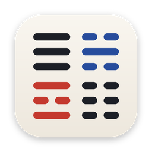

<p align="center">
  
</p>

<h1 align="center">livenote2</h1>

<p align="center">
봇 없이 회의를 기록하는 로컬 우선 macOS 노트테이커.<br/>
실시간 전사 · 한국어 번역 · 화자 자동 인식 · 자동 요약 · 회의 기록과의 AI 대화까지 한 앱에서.
</p>

---

## 무엇을 하는 앱인가

Granola(클라우드 처리·유료)와 Alt(화자구분 유료)의 개인용 대체입니다. 마이크(나)와 시스템 오디오(상대방)를 동시에 캡처해 영어 회의를 실시간으로 기록하고, 원하면 한국어 번역을 나란히 보여주며, 회의가 끝나면 자동으로 상세 요약을 만듭니다. 기본 설정에서 모든 처리는 Mac 안에서 끝나고, 더 높은 품질이 필요하면 클라우드(Gemini) 백엔드를 선택할 수 있습니다.

## 기능

### 기록

| 기능 | 설명 |
|---|---|
| 봇 없는 2채널 캡처 | 마이크 = 나, 시스템 오디오 = 상대방 (Core Audio Process Tap, 가상 드라이버 불필요) |
| 실시간 영어 전사 | Parakeet TDT v2 (CoreML/ANE, 100% 로컬), 잠정/확정 2단계 표시 |
| 자연스러운 문장 분리 | 토큰 타임스탬프 기반 내부 문장 경계 분할 + 경계 안정화 후처리 |
| 고유명사 자동 교정 | 캘린더 참석자 이름과 대조해 ASR이 뭉갠 이름을 보정 |

### 화자

| 기능 | 설명 |
|---|---|
| Zoom 화자 자동 인식 | Zoom 참가자 타일의 활성 화자 표시를 읽어 (손쉬운 사용 권한) 발화 구간마다 실명을 자동 부여. 수동 입력 불필요 |
| Zoom 뮤트 동기화 | Zoom에서 음소거하면 앱의 마이크 기록도 자동 뮤트, 해제하면 재개. 스피커 에코 유입을 습관 그대로 차단 |
| 비 Zoom 폴백 | Zoom이 아닐 때는 LS-EEND 스트리밍 화자구분 (상대방 1/2/3, 클릭 편집·참석자 원클릭 배정) |
| 에코 방어 | 뮤트 버튼(⌘⇧M) + 3층 자동 필터 (포락선 상관 게이트, 세그먼트 폐기, 텍스트 dedup) |

### 번역

| 기능 | 설명 |
|---|---|
| 번역 켬/끔 | 체크박스 하나. 끄면 영어 전용 (한국어가 필요 없는 사용자용, 언어팩 요청도 없음) |
| 백엔드 선택 | 로컬 = Apple Translation (오디오가 Mac 밖으로 안 나감) / 클라우드 = Gemini Live Translate (문장 절단과 무관하게 오디오를 직접 번역해 품질 우위) |
| 클라우드 안정성 | 세션 선제 로테이션, 무제한 재연결(백오프), 연결 표시등, 진단 로그 |

### 회의 후

| 기능 | 설명 |
|---|---|
| 자동 상세 요약 | 중지하면 자동 생성. 주제별 섹션, 수치·이름·근거 보존, Next Steps 액션 아이템. 백엔드에 따라 Qwen3.5-4B(로컬) 또는 Gemini 3.7 Flash |
| AI 대화창 | 화면 하단에서 회의 기록에 대해 질문. **회의 진행 중에도 현재까지의 내용으로 즉시 캐치업 가능.** 저장 회의를 열면 그 회의가, 열지 않으면 전체 아카이브가 대상. 모델(Gemini 3.7 Flash / Qwen3.5 4B)은 독립 선택 |
| 아카이브 | 회의별 `session.json` + `en.md` / `ko.md` / `combined.md` / `summary.md`, 캘린더 일정 제목이 회의명으로 저장 |

### 자동화

| 기능 | 설명 |
|---|---|
| 오늘 일정 | 사이드바에 남은 일정 표시, 회의 시간이 되면 "지금 시작" 버튼 |
| 회의 1분 전 팝업 | 우상단 플로팅 알림, Zoom 딥링크로 브라우저 없이 참가 + 기록 자동 시작 |
| 자동 시작/종료 | Zoom/Teams/Webex 실행·종료 감지, 4분 무음 시 자동 저장, 메뉴바 상주 |
| 뮤트 발화 경고 | 뮤트 상태에서 말하면 배너로 알려 기록 유실 방지 |

## 사용법

1. **시작**을 누르거나, 사이드바 "오늘 일정"의 **지금 시작**, 또는 1분 전 팝업의 **Zoom 참가**로 기록을 시작합니다.
2. 전사가 올라오고, 번역이 켜져 있으면 확정 문장 아래 한국어가 붙습니다.
3. 회의 중 하단 대화창에 "지금까지 무슨 얘기 했어?" 같은 질문을 하면 현재 회의 내용으로 바로 답합니다.
4. **중지**하면 저장과 요약이 자동으로 진행됩니다.
5. 사이드바에서 지난 회의를 열어 다시 보거나, 그 회의에 대해 질문합니다.

## 설치

```bash
git clone https://github.com/ByungjooChoi/LiveNote.git
cd LiveNote
open livenote2.xcodeproj   # Xcode에서 ⌘R
```

배포용 패키징(DMG + sha256 + 설치 가이드):

```bash
./script/package.sh 1.0.9   # 결과물: dist/
```

첫 시작 시 권한: 마이크, 화면 및 시스템 오디오 녹음, 캘린더(일정 연동), 손쉬운 사용(Zoom 화자 인식). ad-hoc 서명 빌드라서 재설치 때마다 재허용이 필요합니다. 클라우드 기능은 [Gemini API 키](https://aistudio.google.com/apikey)를 백엔드 메뉴에서 한 번 등록하면 되고, 키는 macOS 키체인에만 저장됩니다.

## 요구사항

Apple Silicon Mac, macOS 15 이상 (개발·검증은 26.x), Xcode 26. 모델은 최초 실행 시 자동 다운로드됩니다 (Parakeet 약 460MB, 요약·채팅 로컬 모델 사용 시 Qwen 약 2.3GB).

## 프라이버시

기본(로컬 백엔드)에서는 전사·번역·화자구분·요약·채팅이 전부 Mac 안에서 처리됩니다. 오디오는 어떤 형태로도 저장하지 않고 텍스트만 남습니다. 클라우드 백엔드를 직접 선택한 경우에만 회의 오디오(번역)와 전사 텍스트(요약·채팅)가 Google Gemini API로 전송됩니다. Zoom 화자 인식은 화면의 참가자 이름을 읽을 뿐 어디로도 전송하지 않습니다.

## 기술 스택

Swift/SwiftUI · [FluidAudio](https://github.com/FluidInference/FluidAudio) (Parakeet TDT v2, LS-EEND) · Apple Translation · [mlx-swift-lm](https://github.com/ml-explore/mlx-swift-lm) (Qwen3.5-4B) · Gemini Live Translate + 3.7 Flash (옵션) · Core Audio Process Tap · EventKit · Accessibility API

## 문서

- [`livenote2-개발스펙.md`](livenote2-개발스펙.md): 재구축 가능한 수준의 전체 스펙 (아키텍처, 튜닝 상수, 밟았던 함정)
- [`AirTranslate-비교분석-리포트.md`](AirTranslate-비교분석-리포트.md), [`참조프로젝트-7종-분석리포트.md`](참조프로젝트-7종-분석리포트.md): 생태계 분석

전신 LiveNote v1(Python + Gemini S2ST)은 `legacy-livenote1` 브랜치에 있습니다. 개인 프로젝트이며 AI 페어(Claude)와 함께 개발했습니다.
